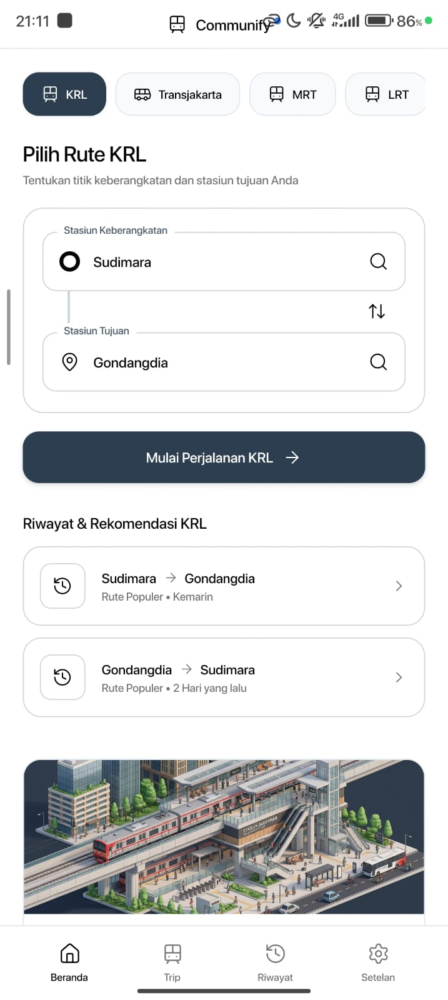
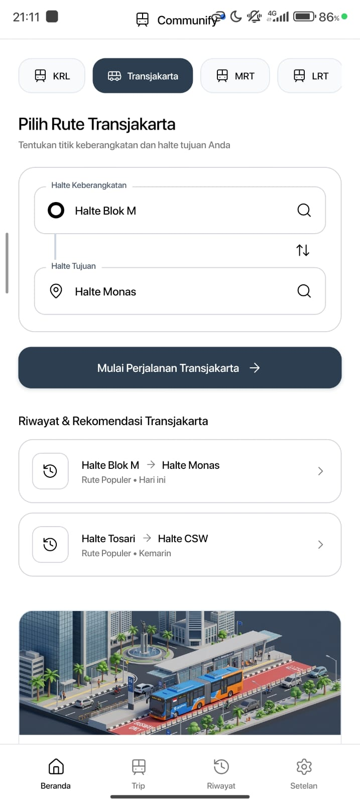
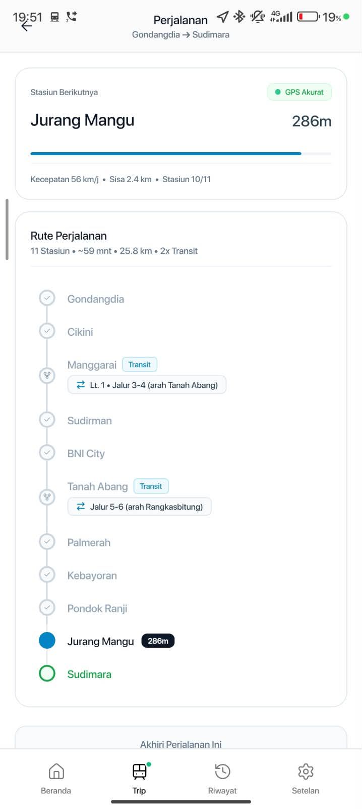
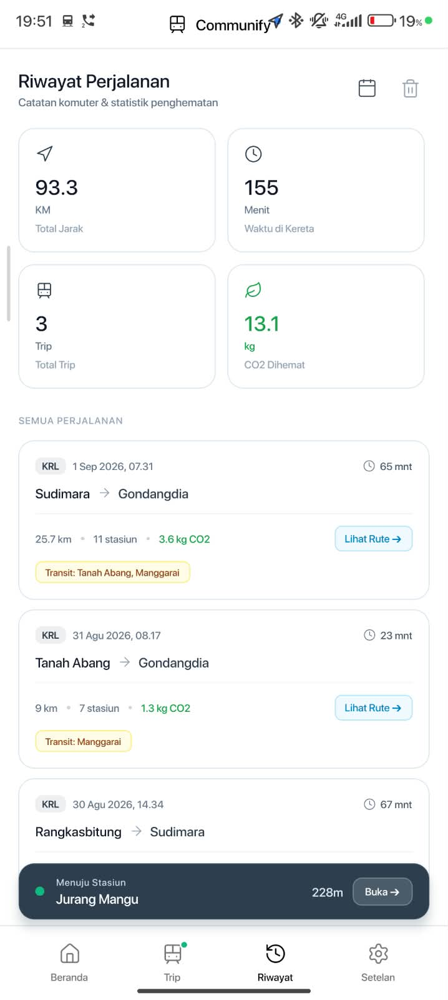

# Communify
**Asisten Transit Cerdas & Pengingat Stasiun/Halte Berbasis Lokasi untuk Jabodetabek**

<p align="left">
  
  
  
  
</p>

[**Unduh APK (Rilis Terbaru)**](https://github.com/zyfdwm/communify-app/releases/latest) • [**Laporkan Masalah**](https://github.com/zyfdwm/communify-app/issues) • [**Catatan Rilis**](#catatan-rilis)

---

**Communify** adalah asisten transportasi publik berbasis latar belakang (*background-first*) yang dirancang khusus untuk komuter harian di kawasan metropolitan Jabodetabek. Dirancang untuk navigasi *hands-free*, Communify berjalan di latar belakang untuk memberikan instruksi suara otomatis (Text-to-Speech) berbahasa Indonesia langsung ke earphone atau TWS Anda, memastikan Anda tidak melewatkan stasiun transit maupun stasiun tujuan akhir saat mendengarkan musik atau tertidur di perjalanan.

---

### Antarmuka Aplikasi

| KRL Commuter Line | Transjakarta BRT | MRT Jakarta | LRT Network |
| :---: | :---: | :---: | :---: |
|  |  |  |  |

---

### Fitur Utama

- **Pengumuman Suara Otomatis ke Earphone (TTS)**: Pengingat cerdas untuk stasiun berikutnya, persiapan transit/pindah peron, dan notifikasi kedatangan tanpa perlu terus-menerus mengecek layar ponsel.
- **Dual-Gate Geofencing (150m / 500m)**: Algoritma *departure radius gate* 150m untuk mencegah alarm berulang saat armada masih berhenti di peron awal, dipadukan dengan zona peringatan 500m sebelum stasiun tujuan.
- **Routing Engine Antarmoda**: Pencarian rute tercepat (*Dijkstra*) multi-hop lengkap dengan panduan perpindahan peron terkini (Layout SO-7 Manggarai & JPO Concourse Baru Tanah Abang).
- **Estimasi Dead Reckoning**: Estimasi pergerakan inersial cerdas saat armada melewati terowongan bawah tanah MRT atau area dengan sinyal GPS terbatas.
- **Layanan Latar Belakang Persisten**: Berjalan sebagai *Android Foreground Service* berprioritas tinggi dengan persistensi data yang tetap aman meski aplikasi diminimalkan.
- **Basis Data Jaringan Offline**: Database stasiun dan koordinat tersimpan lokal di perangkat—tidak memerlukan kuota data aktif untuk pemantauan geofence dasar.
- **Simulator Rute Virtual**: Fitur simulasi bawaan (1x–5x) lengkap dengan kontrol *Lompat Stasiun* untuk menguji rute sebelum berangkat.
- **Analisis Karbon Komuter**: Pencatatan riwayat perjalanan otomatis disertai estimasi penghematan emisi karbon (CO₂).

---

### Cakupan Moda Transportasi

Communify menyediakan pemetaan koordinat dan integrasi rute penuh untuk 4 moda transportasi utama:

```
[ Communify Transit Engine ]
├── KRL Commuter Line
│   ├── Lin Bogor (Jakarta Kota - Bogor / Nambo)
│   ├── Lin Cikarang Loop (Cikarang - Manggarai - Kampung Bandan)
│   ├── Lin Rangkasbitung (Tanah Abang - Rangkasbitung)
│   ├── Lin Tangerang & Tanjung Priok
│   └── Kereta Bandara Soekarno-Hatta (Basoetta)
├── Transjakarta BRT
│   ├── Koridor 1 - 14 (Jaringan Utama BRT Penuh)
│   └── Koridor Layang 13 (Ciledug - Tendean)
├── MRT Jakarta
│   └── Lin Utara-Selatan (Lebak Bulus Grab - Bundaran HI Bank DKI)
└── LRT Network
    ├── LRT Jabodebek (Lin Cibubur & Lin Bekasi)
    └── LRT Jakarta (Pegangsaan Dua - Velodrome)
```

---

### Panduan Instalasi (Sideload Android) & Keamanan

Karena Communify didistribusikan secara independen melalui GitHub Releases (belum dipublikasikan di Google Play Store):

#### 1. Cara Instalasi APK
1. **Unduh File APK**: Unduh file `.apk` versi terbaru dari [halaman Releases](https://github.com/zyfdwm/communify-app/releases/latest).
2. **Aktifkan Izin Sumber Tidak Dikenal**:
   - Buka file yang telah diunduh di perangkat Android.
   - Jika muncul dialog keamanan, pilih **Pengaturan / Settings** $\rightarrow$ aktifkan **"Izinkan dari sumber ini / Allow from this source"** untuk browser atau file manager Anda.
3. **Pasang & Buka Aplikasi**: Tekan tombol **Pasang / Install**, lalu buka Communify.
4. **Berikan Izin Akses**:
   - **Izin Lokasi**: Pilih opsi **"Izinkan sepanjang waktu / Allow all the time"** (Background Location) agar pelacakan rute dan pengumuman suara tetap aktif saat layar ponsel terkunci atau disimpan di dalam saku.
   - **Notifikasi**: Berikan izin notifikasi untuk menampilkan status perjalanan di status bar.

#### 2. Informasi Penting Terkait Google Play Protect
Saat memasang file APK di luar Play Store, sistem Android/Google Play Protect mungkin akan memunculkan peringatan seperti *"Aplikasi diblokir oleh Play Protect"* atau *"Pengembang tidak dikenal"*.

> **Mengapa peringatan ini muncul?**  
> Google Play Protect secara otomatis memindai seluruh aplikasi yang dipasang manual (sideload). Karena Communify dirilis secara independen dan tanda tangan digital (*signature*) aplikasi belum terdaftar di database Google Play Store berbayar, sistem keamanan Google menganggapnya sebagai aplikasi baru dari pengembang pihak ketiga.

> **Apakah Communify Aman?**  
> **100% Aman.** Aplikasi Communify bebas dari malware, adware, maupun pelacak data pribadi. Aplikasi ini murni membutuhkan izin lokasi hanya untuk menghitung jarak GPS ke stasiun/halte dan izin suara untuk pengumuman TTS ke earphone Anda.

**Cara Melanjutkan Instalasi jika Diblokir Play Protect:**
1. Pada pop-up peringatan Play Protect, klik **"Rincian lebih lanjut" / "More details"** (biasanya berupa teks kecil berpanah ke bawah).
2. Klik tombol **"Tetap instal" / "Install anyway"**.
3. Aplikasi akan terpasang dengan normal dan siap digunakan.

---

### Catatan Rilis

#### v1.0.0 (Public Beta)
- Rilis perdana versi public beta.
- Dukungan penuh untuk KRL Commuter Line, Transjakarta Koridor 1–14, MRT Jakarta, dan LRT Jabodebek/Jakarta.
- Integrasi audio engine TTS Bahasa Indonesia untuk panduan suara di earphone.
- Routing transit antarmoda dengan panduan peron transit Manggarai & Dukuh Atas.
- Fitur dead reckoning untuk segmen terowongan bawah tanah.
- Simulator perjalanan virtual dan pencatat reduksi jejak karbon.

---

### Umpan Balik & Saran

Untuk melaporkan ketidaksesuaian rute, halte/stasiun yang belum terdaftar, atau memberikan saran fitur baru:
- Buat laporan melalui [**GitHub Issues**](https://github.com/zyfdwm/communify-app/issues).
- Kunjungi tab [**Discussions**](https://github.com/zyfdwm/communify-app/discussions) untuk diskusi fitur dan roadmap pengembangan.

---

<p align="left">
  <sub>Communify Transit Assistant • Jabodetabek Metropolitan Area</sub>
</p>
