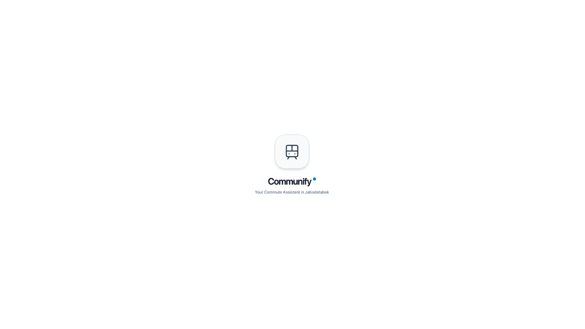

# Communify Transit Assistant
**Asisten Transit Cerdas & Pengingat Stasiun/Halte Berbasis Lokasi untuk Jabodetabek**

  
  
  
  

[**Unduh APK (Rilis Terbaru)**](https://github.com/zyfdwm/communify-app/releases/latest) • [**Laporkan Masalah**](https://github.com/zyfdwm/communify-app/issues) • [**Catatan Rilis**](#catatan-rilis)

---

  

---

### Ringkasan

Lahir dari keresahan gue sebagai pengguna KRL yang baru aja 2 minggu bekerja di Jakarta Pusat, kadang gue suka gatau sudah sampai stasiun mana, terlebih kalau pakai TWS, gue harus lepas pasang TWS buat denger _announcer_ yang kasih tau sudah sampai Stasiun mana. Bahkan, gue pernah ketiduran ketika naik arah ke Manggarai tapi untungnya dibangunin petugas.

Akhirnya, gue kepikiran untuk buat assistant gue sendiri ketika naik KRL, dan yap _meet_ **Communify Transit Assistant**. 

Apps ini gue bangun dengan bantuan AI dengan Vibe-coding. Awalnya masih pakai web-base app. Tapi karena penasaran, akhirnya gue berhasil bikin versi APK nya walaupun belum rilis ke Play Store.

Sederhananya, Communify ini memanfaatkan GPS tracking dari ponsel masing-masing untuk ngelacak perjalanan kalian sudah sampai mana, dan nantinya Communify akan kasih notifikasi suara untuk kasih tau kalian sudah sampai stasiun mana, jadi sekalipun kalian dengerin musik dengan volume yang kencang, kalian akan tetap tau saudah sampai mana tanpa khawatir terlewat stasiun tujuan ataupun transit.

---

### Fitur Communify

Communify sendiri gue bangun di atas idealis dan perfeksionis gue. Tapi, ga semata-mata menghilangkan esensial dan fungsi untuk para penggunanya, Communify sendiri memang gak _perfect_ tapi dia punya sedikit fitur yang cukup buat gue selaku pengguna KRL, seperti:

* Timline perjalanan (dalam kilometer)
* Notifikasi suara tiap sampai stasiun major/minor
* Estimasi perjalanan
* Tersedia untuk rute KRL/MRT/LRT dan Transjakarta

---

### Antarmuka Aplikasi

| Front | Timeline | History | Settings |
| :---: | :---: | :---: | :---: |
|  |  |  |  |

---

### Panduan Instalasi (Sideload Android) & Keamanan

Karena Communify didistribusikan secara independen melalui GitHub Releases (belum dipublikasikan di Google Play Store):

#### 1. Cara Instalasi APK
1. **Unduh File APK**: Unduh file `.apk` versi terbaru dari [halaman Releases](https://github.com/zyfdwm/communify-app/releases/latest). (sementara gue buat dalam format .zip biar ukurannya ga terlalu besar, dan lebih safe)
2. **Aktifkan Izin Sumber Tidak Dikenal**:
   - Buka file yang telah diunduh di perangkat Android.
   - Jika muncul dialog keamanan, pilih **Pengaturan / Settings** $\rightarrow$ aktifkan **"Izinkan dari sumber ini / Allow from this source"** untuk browser atau file manager Anda.
3. **Pasang & Buka Aplikasi**: Tekan tombol **Pasang / Install**, lalu buka Communify.
4. **Berikan Izin Akses**:
   - **Izin Lokasi**: Pilih opsi **"Izinkan sepanjang waktu / Allow all the time"** (Background Location) agar pelacakan rute dan pengumuman suara tetap aktif saat layar ponsel terkunci atau disimpan di dalam saku.
   - **Notifikasi**: Berikan izin notifikasi untuk menampilkan status perjalanan di status bar.

#### 2. Informasi Penting Terkait Google Play Protect
Saat memasang file APK di luar Play Store, sistem Android/Google Play Protect mungkin akan memunculkan peringatan seperti *"Aplikasi diblokir oleh Play Protect"* atau *"Pengembang tidak dikenal"*.

> **Mengapa peringatan ini muncul?**  
> Google Play Protect secara otomatis memindai seluruh aplikasi yang dipasang manual (sideload). Karena Communify dirilis secara independen dan tanda tangan digital (*signature*) aplikasi belum terdaftar di database Google Play Store berbayar, sistem keamanan Google menganggapnya sebagai aplikasi baru dari pengembang pihak ketiga.

> **Apakah Communify Aman?**  
> **100% Aman.** Aplikasi Communify bebas dari malware, adware, maupun pelacak data pribadi. Aplikasi ini murni membutuhkan izin lokasi hanya untuk menghitung jarak GPS ke stasiun/halte dan izin suara untuk pengumuman TTS ke earphone Anda.

**Cara Melanjutkan Instalasi jika Diblokir Play Protect:**
1. Pada pop-up peringatan Play Protect, klik **"Rincian lebih lanjut" / "More details"** (biasanya berupa teks kecil berpanah ke bawah).
2. Klik tombol **"Tetap instal" / "Install anyway"**.
3. Aplikasi akan terpasang dengan normal dan siap digunakan.

---

### Catatan Rilis

#### v1.0.3 (Public Release)
- Perbaikan fitur GPS tracking & background tracking
- Enhancement notifikasi suara (lebih jelas dan keras)
- Perbaikan rute dan peron untuk transit
- Enhancement UI
- Enhancement dead reckoning untuk segmen terowongan bawah tanah
- Minor enhancement
---

### Umpan Balik & Saran

Untuk melaporkan ketidaksesuaian rute, halte/stasiun yang belum terdaftar, atau memberikan saran fitur baru:
- Buat laporan melalui [**GitHub Issues**](https://github.com/zyfdwm/communify-app/issues).
- Kunjungi tab [**Discussions**](https://github.com/zyfdwm/communify-app/discussions) untuk diskusi fitur dan roadmap pengembangan.

---

  Communify Transit Assistant • Jabodetabek Metropolitan Area

